<!DOCTYPE html>
<html>
	<body>
		<article>
		<section>
			<h1>An Introduction to Fade Street</h1>
		</section>
		<section>
			<h2>What is Fade Street?</h2>
			

			<a href="https://gearfo.itch.io/fade-street"><em>Fade Street</em></a> is a plugin for GB Studio.<label for="mn-version" class="margin-toggle">&#8853;</label><input type="checkbox" id="mn-version" class="margin-toggle"/>This version is a fork of the originial FadeStreet made by https://gearfo.itch.io/ . This version works for GB Studio 4.2.0 Beta2 (will be updated until the official 4.2.0 is released).  Take note that this plugin modifies the following engine files: data_manager.c, fade_manager.c, interrupts.c, music_manager.c and vm_palette.c. Any other plugin that modifies these files will not be compatible with FadeStreet (Unless you manually merge the edited engine files). You can use it to create better looking colour fades, as well as many other types of palette effects. It's suitable for use in colour-only games, monochrome-only games, and mixed (black cart) games, although some features are exclusive to certain modes.
			

			
These are some of the effects you can create using <em>Fade Street</em>:

			<figure>
				

					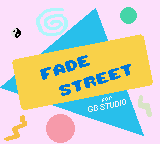</img>
					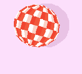</img>
					</img>
					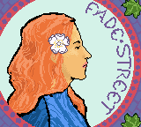</img>
					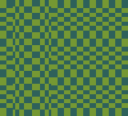</img>
					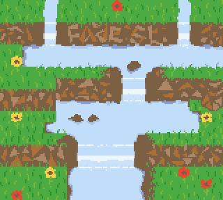</img>
					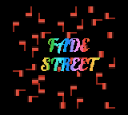</img>
					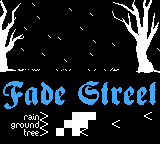</img>
					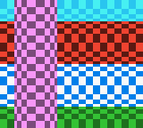</img>
					</img>
					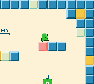</img>
					</img>
					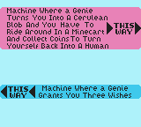</img>
				

			</figure>
		</section>
		<section>
			<h2>What happens if you use this plugin</h2>
				
First, all automatic fades, as well as the built-in <em>Fade In</em> and <em>Fade Out</em> events, are disabled. They just do not work at all in any situation.

				
Second, a new event category, <em>Fade Street</em>, is added, with 23 new events to manage colour fades and colour cycles. The new events are better than the defaults.

			</ol>
			

			By default, GB Studio games generate colour fades using a very simple algorithm that can run on a Game Boy.
			Your PC is a much more powerful computer than a Game Boy, so it can create much better looking and much more complicated colour effects.
			

			

			This is the fundamental concept behind <em>Fade Street</em>: instead of creating colours on-the-fly using the Game Boy CPU<label for="mn-pals" class="margin-toggle">&#8853;</label><input type="checkbox" id="mn-pals" class="margin-toggle"/>You can use <em>Fade Street</em> without understanding how colours work on the Game Boy and Game Boy Color, but brushing up on the basics wouldn't hurt&mdash;the more you understand, the easier it is to plan more complicated art and effects.  No knowledge of GBVM is assumed or required. You'll use the GUI events and all the scripts will get compiled behind the scenes., we calculate them ahead of time on a PC and just store the results on the Game Boy ROM.
			

			

			All the <em>Fade Street</em> events generate GBVM scripts, which contain precalculated colour palettes and exact timing information. Your game no longer needs to calculate any colours at run time; it just runs the script to play back the precalculated effect.
			

		</section>
		<section>
			<h2>Adding <em>Fade Street</em> to a GB Studio project</h2>
			
To add <em>Fade Street</em> to your GB Studio project, simply copy the directory <code>FadeStreetPlugin/</code> into the <code>plugins/</code> subdirectory of your project.
			

			

			This will add the new events to the <em>Add Event</em> menu for your project, as well as automatically applying the relevant engine modifications when you compile your game.
			

		</section>
		<section>
			<h2>What are the disadvantages of using Fade Street?</h2>
			
There are a few drawbacks to using <em>Fade Street</em>. First, because the automatic fades are disabled, you need to add events to each scene to manually control the fade in and fade out. This means a few extra clicks to set up each new scene. Some fade events have more options than the default events, which adds a few more clicks on top of that.

			

			Second, the new events use more ROM space than the automatic fades.<label for="mn-space" class="margin-toggle">&#8853;</label><input type="checkbox" id="mn-space" class="margin-toggle"/>If you are a beginner Game Boy developer, do not worry about ROM size.  You've probably heard a lot of stories about how your favourite game developers worried about ROM size. Those stories get shared a lot, not because data compression and space optimisation is incredibly important for Game Boy development, but because the stories are interesting and easy to understand for a wide audience.  For GB Studio developers in 2024, ROM size is less relevant than you might expect. If you're making your first game, just worry about creating something (anything). Fades with more colour steps take more ROM space, and some special effects like colour cycles can use quite a lot of ROM space, depending on the options you choose.
			

		</section>
		<section>
			<h2>What are the advantages of using Fade Street?</h2>
			

			At a basic level, all your scene transitions will look better, because the fade in and fade out effects will look better. But the real power of <em>Fade Street</em> comes into play when you move beyond basic fades to more complicated palette effects.
			

			
The new events enable you to create a huge variety of effects, from day-night cycles, to rain, snow, and water effects, to pseudo-3D effects, to dissolves, and many more. Some of these effects would be difficult or impossible to program using the default GB Studio events.

		</section>
		<section>
			<h2>Fades and colour cycles</h2>
			
The effects that <em>Fade Street</em> can create are broadly divided into two groups: <em>fades</em> and <em>colour cycles</em>.

			
By <em>fades</em>, we mean taking a starting palette and varying the colours smoothly over time until they reach a target palette<label for="mn-fade-img" class="margin-toggle">&#8853;</label><input type="checkbox" id="mn-fade-img" class="margin-toggle"/></img> The palettes in this image fade from daytime to nighttime to a gold. . That includes not only fading in and out to black or white, but also other transitions such as fading from a daytime palette to a nighttime palette, or highlighting a certain area on the screen. This is an example of a fade:

			<figure>
				</img>
			</figure>
			
Note that some colours can get darker while others get lighter. Individual colours can also stay the same.

			
By <em>colour cycles</em>,<label for="mn-cycle" class="margin-toggle">&#8853;</label><input type="checkbox" id="mn-cycle" class="margin-toggle"/> The snow and lights in this image are animated using colour cycling.  </img>Colour cycling is also known as <em>palette shifting</em> or <em>palette cycling</em>.  To learn more about the general concept of colour cycling, see the work of <a href="https://www.youtube.com/watch?v=aMcJ1Jvtef0">Mark Ferrari</a>. Bear in mind that graphics on the Game Boy Color are a lot more limited than 256 colour VGA. we mean shuffling around the colours of the on screen palettes in a predetermined order. As a colour moves to different palette slots, this can create a sense of motion on screen, so colour cycles can be useful for animating things that are flowing, spinning, flickering, etc. This is an example of a colour cycle:

			<figure>
				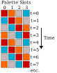</img>
			</figure>
			

			This cycle takes four time steps per iteration. The first iteration ends at t=3, and a second iteration begins at t=4. All cycles created by <em>Fade Street</em> can loop seamlessly in this manner.
			

			
When an event creates a fade <em>with</em> a colour cycle, that just means that the colours used in the cycle can be faded along with the rest of the palettes. For example, if a waterfall is animated using a colour cycle, we could fade from  day to night without pausing the animation. This is an example of a colour cycle which is faded to white as the cycle progresses:

			<figure>
				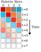</img>
			</figure>
		</section>
		<section>
			<h2>Simple, standard, special</h2>
			
A lot of the <em>Fade Street</em> events are labelled with these adjectives: <em>Simple</em>, <em>Standard</em>, and <em>Special</em>. These terms just refer to how simple or complex the event options are; the underlying colour calculations and logic remain the same.

			
A <em>Standard</em> fade event lets you choose the palettes at both the start and end the fade.

			
For <em>Simple</em> fades, one endpoint is chosen from a list of presets. This speeds up the process of programming common effects like "Fade to black", etc.

			
<em>Special</em> fade events have the most complicated settings, and exist to cover edge cases and bridge the gap between other events. You choose palettes for both endpoints, <em>and</em> you have the option to apply a preset effect to either endpoint.

		</section>
		<section>
			<h2>Bespoke colour cycles</h2>
			

			The <em>Simple, Standard, and Special Fade with Colour Cycle</em> events share an important limitation: the order of the palette slots <label for="mn-slot" class="margin-toggle">&#8853;</label><input type="checkbox" id="mn-slot" class="margin-toggle"/>Where it's important, we'll distinguish between <em>colours</em>&mdash;things like <em>red</em> or RGB(11, 0, 29)&mdash;and <em>palette slots</em>, which is a place for us to store a colour in a palette.  With the Game Boy Color, we're working with 32 palette slots for the background, and we have a choice of 32,768 colours to put in those slots. in the cycle is fixed, and the number of colours in the cycle must equal the number of slots.
			

			
In other words, slot 0 of a palette will always come before slot 1. Slots in background palette 5 will always come later than slots in background palette 4. If you have 10 slots included in the cycle, then 10 colours will cycle through those slots.

			
In some cases you will need more flexibility than those limitations allow. In those cases, you can use <em>Bespoke Colour Cycle</em> events. These events let you enter the exact ordering of palette slots to use in the cycle, as well as a list of colours of any length.

			<h3>Entering palette slots</h3>
			
Palette slots are entered as a comma separated list of base-ten numbers. Slots are numbered from 0&ndash;63, starting at the first slot of the first background palette and ending at the last slot of the eighth sprite palette.

			
This numbering scheme includes the transparent slots of the sprite palettes, but writing to these slots has no effect. The following diagram illustrates how the slots are numbered:

			<figure>
				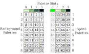</img>
			</figure>
			
For background palettes, slots 0, 1, 2, and 3 of each palette correspond to GB Studio's white, light grey, dark grey, and black colours, respectively.

			
For sprite palettes, slots 0, 1, 2, and 3 of each palette correspond to GB Studio's transparent, white, light grey, and black colours, respectively.

			<h3>Entering colours</h3>
			
Colours are also entered as a comma separated list. You have the option of several colour formats to choose from. All the colours in the list must be entered in the same format.

			
If&mdash;and only if&mdash;you want to copy hexadecimal colour values from the GB Studio palettes screen, choose the <em>GBS representative hex</em> option. This option is useful if you want to match colours to existing GB Studio palettes.

			
If you want to copy hexadecimal values from another graphics program, choose either <em>sRGB 24-bit hex</em> or <em>linear RGB 24-bit hex</em>. If you don't know which option to pick, try both: only one will look correct, and that's the one that you should use.

			
To enter RGB components separately, choose <em>RGB components</em>. You must enter three components for each colour, and each component must be an integer between 0 and 31, inclusive.

			
To enter colours in the native Game Boy format, choose <em>Game Boy 15-bit hex</em>. This option may be useful if you want to copy palettes from an emulator.

			
In all cases, a leading <code>#</code> or <code>0x</code> is optional.

		</section>
		<section>
			<h2>Automagic fades</h2>
			
For the most part, Fade Street lets you manage palettes in a way that's completely separate from the default GB Studio behaviour; the palettes that you set for a scene in the GB Studio editor will have no effect on the palette that appear on screen.

			
An exception to this rule comes in the form of the <em>Automagic</em> events: <em>Automagic Fade In</em>, <em>Automagic Fade Out</em> and <em>Automagic Special Fade</em>. These events work directly with the scene palettes set in the GB Studio editor, including automatic background palettes, if present.

			
Another unique feature of these events is that they will work in both colour and monochrome modes. Depending on your project settings, the events will store a monochrome fade, a colour fade, or both on the ROM, and the correct one will be chosen at run time.

			
These events are the closest thing that <em>Fade Street</em> has to a drop-in replacement for the default <em>Fade In</em> and <em>Fade Out</em> events, and they may be especially useful for beginners or people migrating large GB Studio projects.

		</section>
		<section>
			<h2>Monochrome mode</h2>
			

			Two events are exclusively for use in monochrome mode: <em>DMG Fade</em> and <em>DMG Palette Cycle</em>.<label for="mn-dmg" class="margin-toggle">&#8853;</label><input type="checkbox" id="mn-dmg" class="margin-toggle"/><em>DMG</em> here stands for <em>Dot Matrix Game</em>, a code name for the original 1989 Game Boy. We'll use the term broadly to encompass all monochrome Game Boys, including the Game Boy Pocket and Game Boy Light.  The <em>Super Game Boy</em> also uses monochrome mode, even if there are obviously colours on screen. Colour mode comes into play when a game explicitly target the extra colour features of the Game Boy Color and later consoles.
			

			
<em>DMG Fade</em> includes the option to flicker intermediate colours. This means rapidly alternating between two colours to create the illusion of a middle colour. Using this method, you can create the appearance of three extra colours in between the four normal shades of grey (seven colours in total), for a smoother colour gradient. However, the effectiveness of this technique strongly depends on the type of screen that it's viewed on.

			
Original Game Boy screens tend to blur successive frames together, making this kind of effect look good. On newer screens, or with certain emulators, it can result in a very unpleasant visible flicker. Use this option with caution.

		</section>
		<section>
			<h2>"Black cart" games</h2>
			

			As mentioned above, the <em>Automagic</em> events are the only ones that work in both colour mode and monochrome mode automatically.<label for="mn-cart" class="margin-toggle">&#8853;</label><input type="checkbox" id="mn-cart" class="margin-toggle"/>Originally, Game Boy games came on cartridges that had a grey shell. When the Game Boy Color was released, games exclusive to that console came in a transparent shell.  Games with backwards compatability, which could use the new features of the Game Boy Color, but still ran on monochrome Game Boys, came in a coloured shell&mdash;often black.  The term "black cart" is sometimes used to refer to these backwards compatible games, even though the shells came in various other colours, too.
			

			

			It's possible to use the other events in dual-compatible games, but they need to be wrapped in a <em>If Color Mode Is Available</em> event. Create one fade for monochrome mode, and another fade for colour mode, and use an <em>If Colour Mode Is Available</em> event to choose between them at run time.
			

		</section>
		<section>
			<h2>Multiple fades or colour cycles in a single event</h2>
			

			Sometimes you'll need to have two or more separate fades or colour cycles running at the same time. For example, in a city scene, you might want to animate traffic lights with a slow colour cycle, and a neon sign with a faster cycle.

			

			In those cases, you have the option of using the events <em>Multiple Fades With Colour Cycles</em> or <em>Multiple Bespoke Colour Cycles</em> to control several independent palette effects inside one event. Each event has eight tabs, and you can create a different effect in each tab which will run simultaneously with the others.
			

			 

			Using these events can be more CPU efficient because the effects will be combined into one script running in one GBVM thread. It also ensures that all the effects are completely synchronised.
			

			

			The synchronisation can cause issues if the different cycles have different lengths, however. If one cycle takes 25 frames and another takes 50 frames, the overall effect will loop after 50 frames, and the event will be 50 frames long.
			If one cycle takes 19 frames and another takes 17 frames, the overall effect will take 323 frames to loop, and thus the event will be 323 frames long.<label for="mn-lcm" class="margin-toggle">&#8853;</label><input type="checkbox" id="mn-lcm" class="margin-toggle"/>We care about the <a href="https://en.wikipedia.org/wiki/Least_common_multiple">Least commmon multiple</a> of the cycle lengths.
			

			

			When using these events, you have to pick reasonable values for the cycle lengths.
			

			<h3>BlendShift Cycling</h3>
			

			These two events also feature the option&mdash;not available in the other cycle events&mdash;to do <em>BlendShift Cycling</em><label for="mn-blend" class="margin-toggle">&#8853;</label><input type="checkbox" id="mn-blend" class="margin-toggle"/>BlendShift Cycling was described in <a href="http://www.effectgames.com/effect/article-Old_School_Color_Cycling_with_HTML5.html">this interview</a> with Mark Ferrari., where cycle colours fade into one another instead of making discrete jumps.
			

			
This can greatly enhance certain colour cycling effects, but it forces palettes to update every frame, which can can create very large scripts<label for="mn-banksize" class="margin-toggle">&#8853;</label><input type="checkbox" id="mn-banksize" class="margin-toggle"/>OK, you have to worry about ROM size a <em>little bit</em>. Don't create scripts that are so big that your game can't compile.. Use it in moderation.

		</section>
		<section>
			<h2>Next Steps</h2>
			<h3>Learning more</h3>
			
A demo project is included in the <code>FadeStreetPluginExample/</code> directory, which contains examples of most of the <em>Fade Street</em> events in action. That project also has a lot of comments which fill in some more of the practical details of how to use the events.

			
All <em>Fade Street</em> events are listed in the <em>Fade Street</em> group. Additionally, five events are listed separately in the <em>Fade Street - Beginner Friendly</em> group. These events may be some of the easier ones to get started with.

			<h3>Finding inspiration</h3>
			
In some ways, the challenging part of <em>Fade Street</em> isn't actually using the events, or learning the options; it's knowing <em>when</em> to use them, and understanding the effects you want to create.

			
Among Game Boy Color games, <a href="https://www.youtube.com/watch?v=oPExkCFzuO4&t=273"><em>Shantae</em></a> has great examples of how to use palette fades for artistic effect, but you can find inspiration in lots of other places. Many of the best examples of colour cycling come from systems with better graphics capabilities than the Game Boy Color, like the Amiga, PC, SNES, Mega Drive, etc.

			<h3>Yes, and...</h3>
			
Almost all of the animations shown here and in the demo project were created entirely using palette effects. That makes them good at highlighting what the plugin does, but it doesn't show you the true limits of what you can achieve in your games. In <em>your</em> game, you'll be able to combine palette effects with sprite animations, tile swapping, submapping, and raster effects<label for="mn-swap" class="margin-toggle">&#8853;</label><input type="checkbox" id="mn-swap" class="margin-toggle"/>I like to call tile swapping "updating the tile set" and submapping "updating the tile map", because that's what's happening in each case.  You can see a visualisation of what those methods involve <a href="https://geminorons.neocities.org/wiaf#figJ">here</a>. to create more advanced graphical effects.
			

			
If you aim high, and experiment a bit, you'll be able to create an even more diverse and impressive range of effects in your games.

			
<em>Go n-éirí leat!</em>
			

		</section>
		</article>
	</body>
</html>
