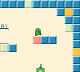
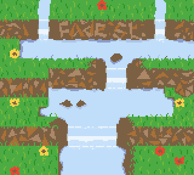
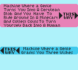
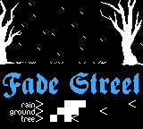
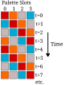
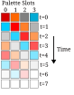
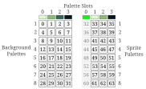
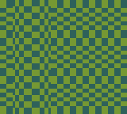
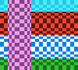

# gbs-fadestreet

**Version 4.3.1 — Requires GB Studio ≥ 4.3.0**

[*Fade Street*](https://gearfo.itch.io/fade-street) is a GB Studio plugin for creating better looking colour fades, as well as many other types of palette effect. It is suitable for colour-only games, monochrome-only games, and mixed ("black cart") games, although some features are exclusive to certain modes.

By default, GB Studio generates colour fades with a very simple algorithm that can run on a Game Boy. Your PC is far more powerful, so it can produce much better looking and much more complicated colour effects. That is the idea behind Fade Street: instead of calculating colours on the fly on the Game Boy, they are calculated ahead of time on your PC and the results are stored in the ROM. Your game just plays back the precalculated effect.

No knowledge of GBVM is required — you use the GUI events and the scripts are compiled behind the scenes.

This version is a fork of the original Fade Street by [gearfo](https://gearfo.itch.io/).

  
  

---

## Table of Contents

1. [Concepts](#concepts)
2. [Project Setup](#project-setup)
3. [Size Limits and Restrictions](#size-limits-and-restrictions)
4. [Events Reference](#events-reference)
5. [Media](#media)
6. [Memory Footprint](#memory-footprint)
7. [Bank 0 (HOME) Usage](#bank-0-home-usage)
8. [Changelog](#changelog)

---

## Concepts

### Fades and colour cycles

The effects Fade Street can create fall into two broad groups.

A **fade** takes a starting palette and varies the colours smoothly over time until they reach a target palette. That includes fading in and out to black or white, but also transitions such as day to night, or highlighting a certain area of the screen. Some colours can get darker while others get lighter, and individual colours can stay the same.

A **colour cycle** shuffles the colours of the on-screen palettes in a predetermined order. As a colour moves through palette slots it creates a sense of motion, which is useful for animating things that flow, spin or flicker.

The cycle above takes four time steps per iteration; the first ends at t=3 and a second begins at t=4. All cycles created by Fade Street loop seamlessly this way.

When an event creates a fade **with** a colour cycle, the colours used in the cycle are faded along with the rest of the palettes — so a waterfall animated by a colour cycle can fade from day to night without pausing its animation.

### Simple, Standard, Special

Many Fade Street events are labelled with one of these words. They describe how complex the event's options are; the underlying colour calculations are the same.

| Label | Options |
|---|---|
| **Standard** | You choose the palettes at both the start and the end of the fade. |
| **Simple** | One endpoint is chosen from a list of presets, which speeds up common effects like "fade to black". |
| **Special** | The most complicated settings. You choose palettes for both endpoints *and* can apply a preset effect to either one. Useful for edge cases and for bridging the gap between the other events. |

### Bespoke colour cycles

The Simple, Standard and Special *Fade with Colour Cycle* events share a limitation: the order of the palette slots in the cycle is fixed, and the number of colours in the cycle must equal the number of slots. Slot 0 always comes before slot 1; slots in background palette 5 always come after those in palette 4.

When you need more flexibility, the **Bespoke Colour Cycle** events let you enter the exact ordering of palette slots to use, plus a list of colours of any length.

**Entering palette slots.** Slots are a comma-separated list of base-ten numbers, numbered 0–63 from the first slot of the first background palette to the last slot of the eighth sprite palette. The numbering includes the transparent slots of the sprite palettes, but writing to those has no effect.

For background palettes, slots 0–3 of each palette are GB Studio's white, light grey, dark grey and black. For sprite palettes, slots 0–3 are transparent, white, light grey and black.

**Entering colours.** Colours are also a comma-separated list, all in the same format:

| Format | When to use it |
|---|---|
| **GBS representative hex** | Copying hex values from the GB Studio palettes screen, to match existing GB Studio palettes. |
| **sRGB 24-bit hex** / **linear RGB 24-bit hex** | Copying hex values from another graphics program. If you don't know which, try both — only one will look correct. |
| **RGB components** | Entering channels separately; three components per colour, each an integer 0–31. |
| **Game Boy 15-bit hex** | The native Game Boy format, useful for copying palettes from an emulator. |

A leading `#` or `0x` is optional in every hex format.

### Automagic fades

For the most part Fade Street manages palettes completely separately from GB Studio's own behaviour, and the palettes you set for a scene in the editor have no effect on what appears on screen.

The **Automagic** events are the exception. They work directly with the scene palettes set in the GB Studio editor, including automatic background palettes. They also work in both colour and monochrome modes: depending on your project settings they store a monochrome fade, a colour fade, or both, and the correct one is chosen at run time.

These are the closest thing Fade Street has to a drop-in replacement for the default Fade In and Fade Out events, which makes them useful for beginners and for migrating large existing projects.

### Monochrome mode

Two events are exclusively for monochrome mode: **DMG Fade** and **DMG Palette Cycle**.

DMG Fade includes an option to flicker intermediate colours — rapidly alternating between two colours to give the illusion of a third. This can produce three extra shades between the four normal greys, for a smoother gradient.

Original Game Boy screens blur successive frames together, which makes this look good. On newer screens, or in some emulators, it can produce very unpleasant visible flicker. Use it with caution.

 

### Running several effects at once

Sometimes you need two or more separate fades or colour cycles running at the same time — traffic lights on a slow cycle and a neon sign on a faster one, say. **Multiple Fades With Colour Cycles** and **Multiple Bespoke Colour Cycles** each have eight tabs, one effect per tab, all running simultaneously.

This is more CPU-efficient, because the effects are combined into a single script running in one thread, and it guarantees the effects stay synchronised.

Those two events also offer **BlendShift Cycling**, not available in the other cycle events, where cycle colours fade into one another instead of jumping. It can greatly enhance certain effects, but it forces palettes to update every frame, which creates very large scripts. Use it in moderation.

---

## Project Setup

1. Copy the `FadeStreetPlugin/` directory into your project's `plugins/` subdirectory. This adds the new events to the *Add Event* menu and automatically applies the engine modifications when you compile.
2. Because automatic fades are disabled, add fade events to each scene to control fade in and fade out manually.

A demo project is included in `FadeStreetPluginExample/`, containing examples of most Fade Street events in action, with comments filling in the practical details.

### Black cart (dual-compatible) games

The Automagic events are the only ones that work in both colour and monochrome mode automatically. The other events can still be used in dual-compatible games by wrapping them in an *If Color Mode Is Available* event: create one fade for monochrome mode and another for colour mode, and let that event choose between them at run time.

---

## Size Limits and Restrictions

- **Automatic fades and the built-in Fade In / Fade Out events are disabled.** They do not work at all in any situation once this plugin is installed. Every scene needs its fades set up manually.
- **The new events use more ROM than the automatic fades.** Fades with more colour steps take more space, and colour cycles can use quite a lot depending on the options chosen.
- **BlendShift Cycling creates very large scripts**, because it updates palettes every frame.
- **Multi-effect events run for the least common multiple of their cycle lengths.** If one cycle takes 25 frames and another 50, the event is 50 frames long; if one takes 19 and another 17, the event is 323 frames long. Pick cycle lengths that combine sensibly.
- **The plugin replaces several stock engine files** — the fade manager, palette handling, scene loading, music and the interrupt handlers. Any other plugin that also modifies those parts of the engine will not be compatible unless the engine files are merged by hand.

---

## Events Reference

All events appear under the **Fade Street** group. Five of them also appear under **Fade Street - Beginner Friendly** — those are the easiest ones to start with, and are marked below.

### Fades

| Event | Description |
|---|---|
| **Simple Fade** ⭐ | Fade between the current palettes and a preset endpoint. |
| **Standard Fade** ⭐ | Fade between two palettes you choose. |
| **Special Fade** | Fade between two palettes, with an optional preset effect applied to either endpoint. |
| **Looping Fade** ⭐ | A standard fade that repeats. |
| **Looping Special Fade** | A special fade that repeats. |
| **Single Colour Fade** | Fade a single palette slot. |
| **Looping Single Colour Fade** | A single-colour fade that repeats. |
| **Fade One Colour At A Time** | Fade the chosen slots one after another rather than together. |
| **Volume Fade** | Fade the master volume (left and right), affecting all music and sfx channels. Volume commands inside music and sfx may override the values you set. |

### Fades with colour cycles

| Event | Description |
|---|---|
| **Simple Fade with Colour Cycle** | A simple fade running together with a colour cycle. |
| **Standard Fade with Colour Cycle** | A standard fade running together with a colour cycle. |
| **Special Fade with Colour Cycle** | A special fade running together with a colour cycle. |
| **Multiple Fades With Colour Cycles** | Up to eight independent fade-plus-cycle effects in one event, optionally with BlendShift Cycling. |

### Colour cycles

| Event | Description |
|---|---|
| **Bespoke Colour Cycle** | A colour cycle with an explicit slot order and a colour list of any length. |
| **Multiple Bespoke Colour Cycles** | Up to eight independent bespoke cycles in one event, optionally with BlendShift Cycling. |

### Automagic

| Event | Description |
|---|---|
| **Automagic Fade In** ⭐ | Fade in using the scene's own palettes as set in the GB Studio editor. Works in both colour and monochrome modes. |
| **Automagic Fade Out** ⭐ | Fade out using the scene's own palettes. Works in both colour and monochrome modes. |
| **Automagic Special Effect** | The scene-palette-driven equivalent of a special fade. |

### Monochrome only

| Event | Description |
|---|---|
| **DMG Fade** | A fade for monochrome mode, with an option to flicker intermediate shades. |
| **DMG Palette Cycle** | A colour cycle for monochrome mode. |

### Utilities

| Event | Description |
|---|---|
| **Quick Load Palettes** | Load a set of palettes immediately, without a fade. |
| **Quick Load DMG Palettes** | The monochrome equivalent. |
| **Set All Palettes to One Colour** | Fill every palette slot with a single colour. |

---

## Media

  
 

---

## Memory Footprint

Measured against the stock GB Studio **4.3.0-e1** engine (per-file SDCC compile with GB Studio's build flags, default engine settings). Values are the plugin's *delta* versus the stock engine; DMG build, with CGB noted where it differs. ROM cost lands in banked ROM (GB Studio's autobanker spreads it across switchable banks); using the plugin's events additionally compiles a few bytes of GBVM script per call into your project's script banks.

| | Cost |
|---|---|
| WRAM | −2 bytes |
| ROM | −143 bytes (DMG) / +165 bytes (CGB) |

- **WRAM:** the plugin's fade state is 2 bytes *smaller* than the stock fade manager's.
- **ROM:** on DMG builds the plugin is a net 143-byte *saving*, because the stock fade path it replaces is bigger; on CGB builds the per-channel perceptual fade tables cost a net 165 bytes. Note that this is engine code only — the precalculated palette data each Fade Street event emits adds its own bytes to your script banks on top, and can be substantial for long fades and cycles.
- **Engine WRAM headroom:** the stock GB Studio 4.3.0 engine leaves about **854 bytes** of WRAM free (usable engine WRAM is 7,776 bytes at 0xC0A0–0xDF00; the stock engine uses 6,922 bytes). With this plugin installed roughly **856 bytes** remain. This figure does not depend on how many global variables your project defines: the script memory array has a fixed size of VM_HEAP_SIZE + (VM_MAX_CONTEXTS × VM_CONTEXT_STACK_SIZE) words — 768 + 16 × 64 = 1,792 words (3,584 bytes) with stock engine settings.
- **SRAM:** not used.

---

<!-- BANK0:BEGIN -->
## Bank 0 (HOME) Usage

Bank 0 is the 16 KB non-switchable ROM bank that the GB Studio engine core,
the interrupt handlers and the GBDK runtime all share. Banked ROM is cheap
(add another bank), bank 0 is not, so it is usually the first thing a project
runs out of.

| | Bytes |
|---|---|
| Bank 0 used by this plugin | **+32** |
| Bank 0 free with this plugin installed | **1,419** of 16,384 (91% used) |

Everything else this plugin adds lives in banked ROM.

| Module | This plugin | Stock engine | Bank 0 cost |
|---|---|---|---|
| `interrupts.c` | 277 | 245 | +32 |

Modules that replace or patch a stock engine file only cost the *difference*:
the stock version's bank 0 bytes were being spent anyway.

How this was measured

GB Studio 4.3.2, DMG target, default engine settings. Each module's bank 0
contribution is the `A _HOME size` record that SDCC writes into its `.rel`
object, summed over the engine sources this plugin provides. Stock sizes come
from building projects whose only plugin ships no engine C, so every module in
them is the untouched engine; two such builds were compared and agreed on all
73 shared modules.

The "free" figure is a stock project with this plugin and nothing else. Your
own number will differ: other plugins, and any engine settings that change what
the core compiles, move it independently of this plugin.

<!-- BANK0:END -->

## Changelog

Grouped by the date each change was merged into the official
[gb-studio-plugins](https://github.com/gb-studio-dev/gb-studio-plugins) repository.

Only bug fixes, new features and feature changes are listed. Engine version
bumps, patch regeneration, packaging fixes and documentation edits are omitted.

### 2026-06-28

- Added ContinuousScenePlugin compatibility.

### 2026-06-14

- Added custom script parameter / stack support to the events.

### 2026-02-14

- Added a compatibility file for use with the ScreenScroll + Metatile plugin combination.

### 2026-02-03

- Fork release.
- Fixed the MOD music kernel panic bug.
